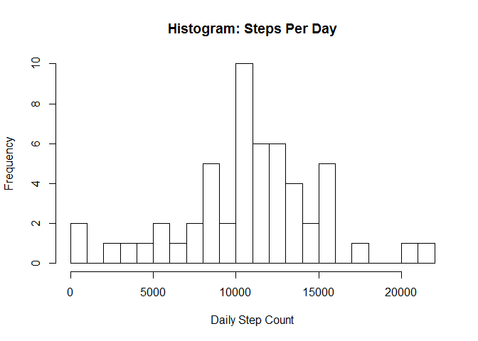
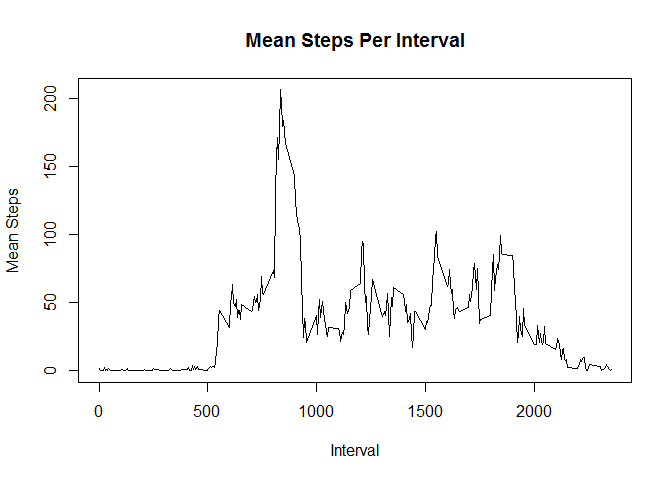
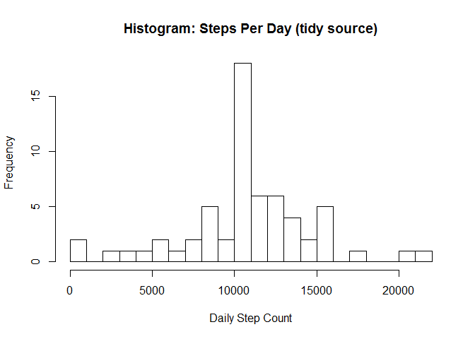
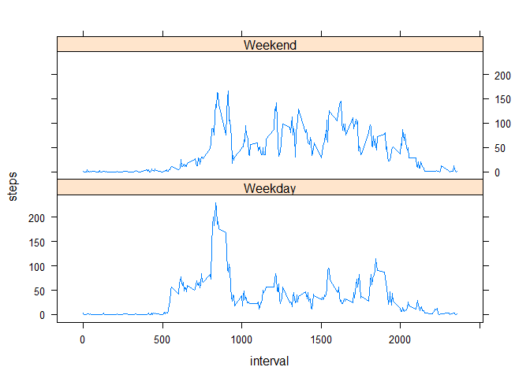

# Reproducible Research: Peer Assessment 1


### Loading and preprocessing the data

```r
dt <- read.csv(file='activity.csv',header=T)
```
#### Sample of the loaded data (notice NA values)

```r
head(dt)
```

```
##   steps       date interval
## 1    NA 2012-10-01        0
## 2    NA 2012-10-01        5
## 3    NA 2012-10-01       10
## 4    NA 2012-10-01       15
## 5    NA 2012-10-01       20
## 6    NA 2012-10-01       25
```
#### Generate total steps per day (excluding NA values)

```r
steps_per_day <- aggregate(steps~date,data=dt,sum,na.rm=TRUE)
head(steps_per_day)
```

```
##         date steps
## 1 2012-10-02   126
## 2 2012-10-03 11352
## 3 2012-10-04 12116
## 4 2012-10-05 13294
## 5 2012-10-06 15420
## 6 2012-10-07 11015
```
#### Histogram of total steps per day

```r
hist(steps_per_day[,2]
     ,breaks=25
     ,main='Histogram: Steps Per Day'
     ,xlab='Daily Step Count')
```

 

### What is mean total number of steps taken per day?
#### (Mean)

```r
mean(steps_per_day$steps)
```

```
## [1] 10766.19
```
#### (Median)

```r
median(steps_per_day$steps)
```

```
## [1] 10765
```

### What is the average daily activity pattern?
#### Calculate mean steps (excluding NA values)

```r
steps_per_int<-aggregate(steps~interval,data=dt,mean,na.rm=TRUE)
head(steps_per_int)
```

```
##   interval     steps
## 1        0 1.7169811
## 2        5 0.3396226
## 3       10 0.1320755
## 4       15 0.1509434
## 5       20 0.0754717
## 6       25 2.0943396
```
#### Plot a graph of average daily activity

```r
plot(steps_per_int$interval
     ,steps_per_int$steps
     ,type="l"
     ,xlab='Interval'
     ,ylab='Mean Steps'
     ,main='Mean Steps Per Interval')
```

 

#### Interval with maximum number of steps

```r
steps_per_int[steps_per_int$steps==max(steps_per_int$steps),1]
```

```
## [1] 835
```

### Imputing missing values
#### Determine number of missing values (steps=NA)

```r
with_na <- dt[!complete.cases(dt),]
head(with_na)
```

```
##   steps       date interval
## 1    NA 2012-10-01        0
## 2    NA 2012-10-01        5
## 3    NA 2012-10-01       10
## 4    NA 2012-10-01       15
## 5    NA 2012-10-01       20
## 6    NA 2012-10-01       25
```

```r
nrow(with_na)
```

```
## [1] 2304
```
#### Replace NAs with mean steps for the respective interval
#### Mean steps will come from dataset steps_per_int (from above)
#### Method
1. Merge steps_per_int with original data by interval
2. Assign mean steps to NA values

```r
dt_cmplt <- dt
head(dt_cmplt)
```

```
##   steps       date interval
## 1    NA 2012-10-01        0
## 2    NA 2012-10-01        5
## 3    NA 2012-10-01       10
## 4    NA 2012-10-01       15
## 5    NA 2012-10-01       20
## 6    NA 2012-10-01       25
```

```r
## merge dt_cmplt with steps_per_int
mg_dt <- merge(dt_cmplt,steps_per_int,by='interval')
head(mg_dt)
```

```
##   interval steps.x       date  steps.y
## 1        0      NA 2012-10-01 1.716981
## 2        0       0 2012-11-23 1.716981
## 3        0       0 2012-10-28 1.716981
## 4        0       0 2012-11-06 1.716981
## 5        0       0 2012-11-24 1.716981
## 6        0       0 2012-11-15 1.716981
```
#### Replace NA values with mean steps value

```r
for (i in 1:length(mg_dt[,1])){
    if (is.na(mg_dt$steps.x[i])) {
        mg_dt$steps.x[i] = mg_dt$steps.y[i]
    }
}
head(mg_dt)
```

```
##   interval  steps.x       date  steps.y
## 1        0 1.716981 2012-10-01 1.716981
## 2        0 0.000000 2012-11-23 1.716981
## 3        0 0.000000 2012-10-28 1.716981
## 4        0 0.000000 2012-11-06 1.716981
## 5        0 0.000000 2012-11-24 1.716981
## 6        0 0.000000 2012-11-15 1.716981
```
#### Verify all NA values were replaced

```r
## rows with steps = NA should be 0
with_na <- mg_dt[!complete.cases(mg_dt),]
nrow(with_na)
```

```
## [1] 0
```
#### Create new, tidy dataset

```r
dt_cmplt <- data.frame(steps=mg_dt$steps.x,date=mg_dt$date,interval=mg_dt$interval)
```
#### Compute average daily steps with NAs replaced

```r
steps_per_int_tidy<-aggregate(steps~interval,data=dt_cmplt,mean,na.rm=TRUE)
head(steps_per_int_tidy)
```

```
##   interval     steps
## 1        0 1.7169811
## 2        5 0.3396226
## 3       10 0.1320755
## 4       15 0.1509434
## 5       20 0.0754717
## 6       25 2.0943396
```
#### Histogram of total steps with NAs replaced

```r
steps_per_day2 <- aggregate(steps~date,data=dt_cmplt,sum,na.rm=TRUE)
hist(steps_per_day2[,2]
     ,breaks=25
     ,main='Histogram: Steps Per Day (tidy source)'
     ,xlab='Daily Step Count')
```

 

#### Mean Steps (tidy)

```r
mean(steps_per_day2$steps)
```

```
## [1] 10766.19
```
#### Median steps (tidy)

```r
median(steps_per_day2$steps)
```

```
## [1] 10766.19
```
#### Median steps (untidy)

```r
median(steps_per_day$steps)
```

```
## [1] 10765
```
#### Conclusion: replacing NAs with mean steps caused median and mean to be equivalent

### Are there differences in activity patterns between weekdays and weekends?
#### Method
1. Add a factor variable for weekend/weekdays to the tidy data set
2. Graph (panel plot) the average number of steps for weekend/weekdays

#### Add dayOfWk, dayType variables to the tidy data set

```r
## day of week added to validate dayType variable
dt_cmplt$dayOfWk <- weekdays(as.Date(dt_cmplt$date))
dt_cmplt$dayType <- ifelse(weekdays(as.Date(dt_cmplt$date)) %in% c('Saturday','Sunday'),'Weekend','Weekday')
head(dt_cmplt)
```

```
##      steps       date interval  dayOfWk dayType
## 1 1.716981 2012-10-01        0   Monday Weekday
## 2 0.000000 2012-11-23        0   Friday Weekday
## 3 0.000000 2012-10-28        0   Sunday Weekend
## 4 0.000000 2012-11-06        0  Tuesday Weekday
## 5 0.000000 2012-11-24        0 Saturday Weekend
## 6 0.000000 2012-11-15        0 Thursday Weekday
```

```r
## make day type a factor
dt_cmplt$dayType <- factor(dt_cmplt$dayType)
## new structure of data set
str(dt_cmplt)
```

```
## 'data.frame':	17568 obs. of  5 variables:
##  $ steps   : num  1.72 0 0 0 0 ...
##  $ date    : Factor w/ 61 levels "2012-10-01","2012-10-02",..: 1 54 28 37 55 46 20 47 38 56 ...
##  $ interval: int  0 0 0 0 0 0 0 0 0 0 ...
##  $ dayOfWk : chr  "Monday" "Friday" "Sunday" "Tuesday" ...
##  $ dayType : Factor w/ 2 levels "Weekday","Weekend": 1 1 2 1 2 1 2 1 1 2 ...
```
#### Create mean over interval and dayType, generate panel plot

```r
steps_per_int_daytype<-aggregate(steps~interval+dayType,data=dt_cmplt[,c(1,3,5)],mean,na.rm=TRUE)
head(steps_per_int_daytype,10)
```

```
##    interval dayType      steps
## 1         0 Weekday 2.25115304
## 2         5 Weekday 0.44528302
## 3        10 Weekday 0.17316562
## 4        15 Weekday 0.19790356
## 5        20 Weekday 0.09895178
## 6        25 Weekday 1.59035639
## 7        30 Weekday 0.69266247
## 8        35 Weekday 1.13794549
## 9        40 Weekday 0.00000000
## 10       45 Weekday 1.79622642
```

```r
## sample interval (interval = 0)
steps_per_int_daytype[steps_per_int_daytype$interval==0,]
```

```
##     interval dayType     steps
## 1          0 Weekday 2.2511530
## 289        0 Weekend 0.2146226
```

```r
## sample interval (interval = 835)
steps_per_int_daytype[steps_per_int_daytype$interval==835,]
```

```
##     interval dayType    steps
## 104      835 Weekday 230.3782
## 392      835 Weekend 138.0837
```

```r
library(lattice)
xyplot(steps~interval|dayType,data=steps_per_int_daytype,layout=c(1,2),type="l")
```

 


